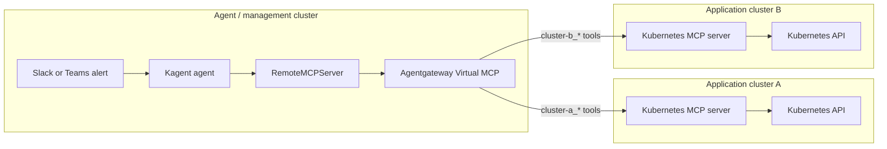

# Kagent Multi-Cluster MCP Demo

This repository is a public-safe demo for building an agentic Kubernetes operations platform with Kagent, Agentgateway, and MCP.

It shows how a platform team can expose read-only Kubernetes tools from multiple application clusters through one federated MCP endpoint, then connect that endpoint to a Kagent agent for incident triage and root-cause analysis.

The demo is intentionally vendor-neutral and anonymized. It does not contain any real company names, cluster names, credentials, Slack workspace IDs, Teams tenant IDs, or production endpoints.

## Why this exists

Most Kubernetes platform teams do not operate one cluster. They operate management clusters, application clusters, shared services, private network paths, incident channels, RBAC boundaries, and approval workflows.

Agentic operations only become useful when they respect those boundaries.

This demo focuses on a safer starting point:

- Keep cluster-local Kubernetes MCP servers inside the clusters they inspect.
- Federate those MCP servers through Agentgateway Virtual MCP.
- Expose one stable MCP endpoint to Kagent.
- Start with read-only tools.
- Add write or exec tools only behind explicit approval and policy.
- Keep sensitive data inside the organization by allowing self-hosted or private LLM deployment models.

## Architecture



## Repository layout

```text
.
├── docs/
│   ├── demo-flow.md
│   ├── guardrails.md
│   └── talk-abstract.md
├── manifests/
│   ├── agentgateway/
│   ├── kagent/
│   ├── mcp-servers/
│   └── policies/
├── scripts/
│   └── verify-demo.sh
└── examples/
    └── incident-prompts.md
```

## Demo story

An alert fires at midnight:

> Checkout API p95 latency is high in production. Error rate increased after the latest rollout.

Instead of asking an operator to manually jump between clusters, the incident channel can call an agent. The agent can:

1. Identify which cluster or namespace is impacted.
2. List pods, deployments, events, and recent rollout state.
3. Compare the same workload across two clusters.
4. Surface real Kubernetes errors instead of guessing.
5. Suggest next steps.
6. Ask for human approval before any write or exec action.

The important part is not that the agent is allowed to do everything. The important part is that the platform decides what the agent is allowed to see and do.

## Prerequisites

This is a manifest-first demo. It assumes you already understand or can install:

- Kubernetes
- Kagent
- Agentgateway
- Gateway API
- A Kubernetes MCP server implementation
- Optional: Slack or Microsoft Teams integration for incident chat

The manifests use placeholder hostnames and namespaces. Replace them with your own demo cluster values before applying.

## Quick walkthrough

Read these files in order:

1. [docs/demo-flow.md](docs/demo-flow.md)
2. [manifests/agentgateway/agentgateway-backend.yaml](manifests/agentgateway/agentgateway-backend.yaml)
3. [manifests/agentgateway/http-route.yaml](manifests/agentgateway/http-route.yaml)
4. [manifests/kagent/remote-mcp-server.yaml](manifests/kagent/remote-mcp-server.yaml)
5. [manifests/kagent/agent-readonly.yaml](manifests/kagent/agent-readonly.yaml)
6. [docs/guardrails.md](docs/guardrails.md)

Then run:

```bash
./scripts/verify-demo.sh
```

The script does not require cluster access. It performs static checks on the demo files and prints the verification flow you should run in a real environment.

## Safety model

This demo separates operations into three levels:

| Level | Capability | Default |
| --- | --- | --- |
| Green | Read-only inspection such as list, get, describe, events, logs | Allowed |
| Yellow | Potentially sensitive read actions such as logs with secrets or `pods/exec` read commands | Approval required |
| Red | Mutating actions such as restart, patch, delete, scale, rollout undo, or secret access | Approval required and usually disabled |

The sample agent is read-only by default.
